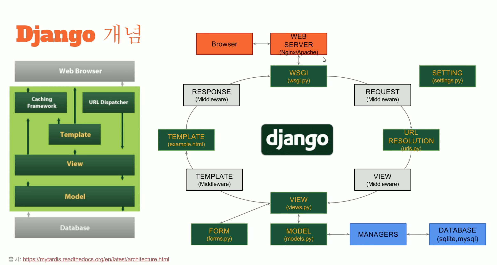
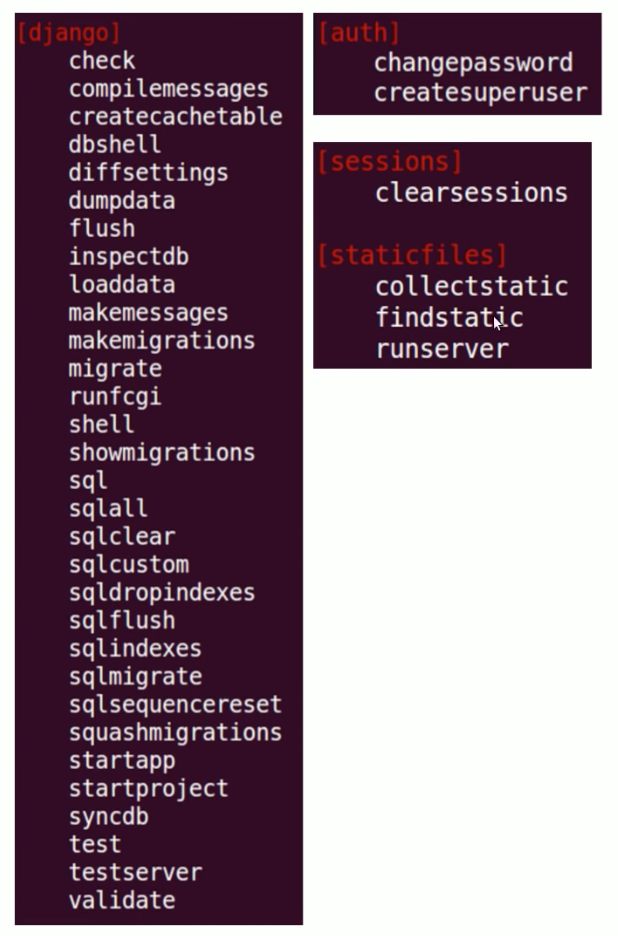

# Django basics 1/2

[인프런 Django 초보가이드](https://www.inflearn.com/course/django-%EC%B4%88%EB%B3%B4-%EA%B0%80%EC%9D%B4%EB%93%9C-%EC%8B%A4%EC%8A%B5%EC%9D%84-%ED%86%B5%ED%95%B4-%EC%95%8C%EC%95%84%EB%B3%B4%EB%8A%94-%EC%9E%A5%EA%B3%A0-%EC%9E%85%EB%AC%B8/) 영상을 보면서 작성.

MVC, MFV 디자인 패턴 => Django의 패턴 개념 => 프로젝트와 앱 다루기 => `settings.py`: 전체 프로젝트 설정관리 파일 => `manage.py`: 전체 프로젝트를 관리하고 db접근을 위한 파일

## MVC & MVT

[the Essence of MVC](http://www.essenceandartifact.com/2012/12/the-essence-of-mvc.html)

* M: Data from-to DB
* V: View (on Client, by Data)
* C: Control, T: Template (by Client)

협업의 효율화를 위해 셋으로 분리한 패턴

## Django의 패턴구현



1. Client에서 Web Server를 향해 요청
1. 요청정보는 WSGI(게이트웨이 인터페이스)를 통과하여 req가 된다
1. `urls.py`는 각 url 엔드포인트에 대한 대응의 집합
1. `views.py`는 DB접근 여부를 판단한다
    1. `models.py`는 DB에 접근한다 (`manage.py`의 도움으로)
    1. `forms.py`는 템플릿 작성을 돕는다
1. template은 html파일을 생성하는 로직을 의미한다
1. 완성된 템플릿은 res에 담겨서 WSGI를 거쳐 Client로 전달된다.

---

* [ ] FE 프레임워크는 여기서 어디를 대체하는가?  
  views.py를 통해 전달된 정보를 template, form을 거치지 않고 바로 req에 담는다고 이해하면 되는지..?

## Project & App

> 장고걸스의 내용을 토대로, django 프로젝

프로젝트 생성

* `$ django-admin startproject <projectName>`
* root folder
    * `manage.py`
    * projectFoler
        * `__init__.py`
        * `settings.py` : 프로젝트 관리
        * `urls.py` : 요청 url 처리 규칙
        * `wsgi.py`

app 생성

* `at-manage.py-dir $ manage.py startapp <appName>`
* root folder
    * appFolder
        * `admin.py` : 관리자 권한 사용자를 위한 페이지
        * `__init.py__`
        * `models.py` : DB 접근 로직
        * `tests.py` : 그냥 테스트
        * `views.py` : DB 데이터 가공로직
        * migrations : DB 관련...(?)
            * `__init__.py`

## `settings.py`

```py
# 디버그 설정
# 에러를 보고싶으면 True => 변수의 상태확인이 가능
# 빌드 시 False
DEBUG = True

# 기본 어플리케이션과 내가 생성한 어플리케이션, 서드파티 어플리케이션(installed by pip)
INSTALLED_APPS = [
    'django.contrib.admin',
    'django.contrib.auth',
    'django.contrib.contenttypes',
    'django.contrib.sessions',
    'django.contrib.messages',
    'django.contrib.staticfiles',
]
 
# req, req 사이에서 인증, 보안 등등의 역할을 하지만 지금은 건드리지 않는다
MIDDLEWARE = [
    'django.middleware.security.SecurityMiddleware',
    'django.contrib.sessions.middleware.SessionMiddleware',
    'django.middleware.common.CommonMiddleware',
    'django.middleware.csrf.CsrfViewMiddleware',
    'django.contrib.auth.middleware.AuthenticationMiddleware',
    'django.contrib.messages.middleware.MessageMiddleware',
    'django.middleware.clickjacking.XFrameOptionsMiddleware',
]

# html 파일과 변수를 views.py에서 관리하기 위한 
TEMPLATES = [
    {
        'BACKEND': 'django.template.backends.django.DjangoTemplates',
        'DIRS': [],
        'APP_DIRS': True,
        'OPTIONS': {
            'context_processors': [
                'django.template.context_processors.debug',
                'django.template.context_processors.request',
                'django.contrib.auth.context_processors.auth',
                'django.contrib.messages.context_processors.messages',
            ],
        },
    },
]

WSGI_APPLICATION = 'tutorial.wsgi.application'

# 데이터베이스 엔진 연결 설정. 장고에서 기본으로 제공하는 sqlite가 연결되어있음
DATABASES = {
    'default': {
        'ENGINE': 'django.db.backends.sqlite3',
        'NAME': os.path.join(BASE_DIR, 'db.sqlite3'),
    }
}

# 정적 파일(css, javascript, img) 경로
STATIC_URL = '/static/'

```

## `manage.py`

프로젝트 관리 명령어의 모음



주요 명령어 알아보기  
____사용법: `(env) $ python manage.py <command>`

* `startapp` 앱 생성
* `runserver 0.0.0.0:<port>` 서버 실행; 기본포트 8000은 외부 접근이 안된다
* `createsuperuser` 관리자 생성
* `makemigrations <appName>` 어플리케이션에서 모델의 변경사항이 있을 때(쿼리가 추가됐다거나..?) 서버와 동기화
* `migrate` 변경사항을 DB에 반영
* `shell` 웹 서버의 데이터 확인
* `collectstatic` 앱 마다 존재하는 스태틱파일을 한곳에 모은다

```py
#!/usr/bin/env python
import os
import sys

if __name__ == "__main__":
    os.environ.setdefault("DJANGO_SETTINGS_MODULE", "tutorial.settings")
    try:
        from django.core.management import execute_from_command_line
    except ImportError:
        # The above import may fail for some other reason. Ensure that the
        # issue is really that Django is missing to avoid masking other
        # exceptions on Python 2.
        try:
            import django
        except ImportError:
            raise ImportError(
                "Couldn't import Django. Are you sure it's installed and "
                "available on your PYTHONPATH environment variable? Did you "
                "forget to activate a virtual environment?"
            )
        raise
    execute_from_command_line(sys.argv)

```

---
